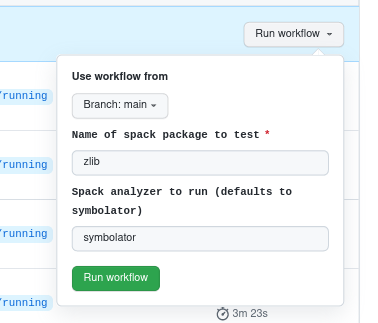

# Spack Monitor Analysis

This repository will host docker base images for interacting with the development
spack monitor, and for building and deploying:

 - across packages
 - across versions
 - across operating systems
 
It's also setup to handle architectures, but we need to host runners to do that.
I'm not sure if this will all work, but it sounded fun to try.

## Instructions

### Building base containers

The base containers are built with the following GitHub workflows:

 - [.github/workflows/gcc-matrices.yaml](.github/workflows/gcc-matrices.yaml): builds gcc base images with spack, smeagle, and symbolator, across gcc versions
 - [.github/workflows/build-deploy.yaml](.github/workflows/build-deploy.yaml): builds the same across ubuntu, centos, and a fedora container, each with a few compilers.
 
To run any of these updates, simply push to a branch, navigate to the "Actions" tab, and then select either of the two workflows:

 - GCC Build Matrices
 - Build Containers
 

And click "Run workflow" and select the branch to trigger. The finished containers will then be pushed to GitHub packages and ready
for use by the analysis pipeline.

### Updating base containers

To do any analysis, we split jobs into operating system (containers) by compilers (also in containers). To get the maximum out of each 6 hour run, we generate a matrix of container and compiler combinations by way of a simple Python script. For example, a base container should be built with a label of:

```bash
compiler_labels=gcc@7.5.0,gcc@9.5.0
```

And then we can programatically discover this set of labels via the image config from the packages registry, and run a script
to parse these labels!

```bash
$ python scripts/generate-matrix.py 
::set-output name=containers::[["ghcr.io/buildsi/spack-ubuntu-18.04", "all"], ["ghcr.io/buildsi/spack-ubuntu-20.04", "all"], ["ghcr.io/buildsi/spack-centos-7", "all"], ["ghcr.io/buildsi/spack-centos-8", "all"], ["ghcr.io/buildsi/spack-fedora", "all"], ["ghcr.io/buildsi/ubuntu:gcc-8.1.0", "all"], ["ghcr.io/buildsi/ubuntu:gcc-7.3.0", "all"], ["ghcr.io/buildsi/ubuntu:gcc-9.4.0", "all"], ["ghcr.io/buildsi/ubuntu:gcc-11.2.0", "all"], ["ghcr.io/buildsi/ubuntu:gcc-4.9.4", "all"], ["ghcr.io/buildsi/ubuntu:gcc-10.3.0", "all"]]
```

So if you need to add a new container base, add the name in the script [scripts/generate-matrix.py](scripts/generate-matrix.py).
If a container does not have compiler labels, then the label "all" is used, and the compilers are programatically discovered in the container.
This can work okay for smaller packages, but for long package builds across versions and compilers, we typically go over the 6 hour limit.

### Running an Analysis

The install and analysis for a package across versions with some set of compilers is done with:

 - [.github/workflows/analysis.yaml](.github/workflows/analysis.yaml) 

The trigger is also a dispatch event, except you need to also enter the package name and analyzer to run.



Analyses are uploaded to spack monitor.

## Analysis Plan

This is what I'm planning to do for a "base level" analysis. The goal is to understand the build space (what builds and what doesn't across packages and compilers, limited by spack) and then to simulate splices, and predict working / not working for each. Then when Nate's splicing
is working, we can validate our predictions.

The container bases here are mostly done, and will be launchable with a dispatch event,
meaning you will just need to enter the package name (from spack) into a UI and press a button.
This will work by way of using each base (an operating system with a few compilers, a customized
version of spack, and analyzers installed) to do the following steps.

### Step 1. Analysis to happen in GitHub Actions

After a dispatch event for package P:

```
For operating systems in ubuntu-18.04, ubuntu-20.04, centos-7, centos-8, fedora:
    for compiler C in a handful of gcc versions and clang in each:
         build package P
         for each of P
              install P with C, send result to monitor
              run spack analyze with symbolator, send result to monitor
```

The above will send a bunch of builds across these variables, and symbolator results
to spack monitor, where they can be interacted with via the UI and API.
We can then do this a bunch of times for some set of packages, and then do analysis.

Analysis enabled by spack monitor database:

```
For a package query, P
    Find all species associated with package, specs (can have varying compilers, etc.)
        Pin a spec A, specA
        For all dependents of A (not limited to built with) choose a specB
        Run symbolator splice with specA to get undefined symbols USA
        Run symbolator splice with specB spliced into SpecB to get another set of undefined symbols USB
        Take diff between USA and USB, if any undefined not previously there, the splice will not work. Otherwise, yes.
```

For the above, when we do the splice, we include *all dependencies of the splce* and if there is an overlapping one, we replace it.
We could also change the code to instead include the new symbols (but not remove the previously linked library) if this is a better approach.
Nobody has discussed this with me in detail so I'm sort-of-doing-whatever for this first pass.
This second part, doing a splice, will also be a UI view to do interactively (this is done, you can do this [here](https://builds.spack.io/analysis/symbols/)).

### Step 2. Programmatic Analysis

This data should also be download-able via the API, so the analysis can be done programmatically.
This is possible via the [splice_analysis_local.py](https://github.com/spack/spack-monitor/blob/main/script/api-examples/splice_analysis_local.py) example script packaged with spack monitor. This will generate a structure of results in
your `~/.spack/spack-monitor/` directory (json corpora) that can go into a local splice.

```bash
$ tree curl/
7.42.1/                      7.50.2/                      7.63.0/                      7.76.0/
7.43.0/                      7.50.3/                      7.64.0/                      7.76.1/
7.44.0/                      7.52.1/                      7.68.0/                      7.77.0/
7.45.0/                      7.53.1/                      7.71.0/                      7.78.0/
7.46.0/                      7.54.0/                      7.72.0/                      7.79.0/
7.47.1/                      7.56.0/                      7.73.0/                      symbolator-predictions.json
7.49.1/                      7.59.0/                      7.74.0/                      
7.50.1/                      7.60.0/                      7.75.0/                     
```

For example, to generate predictions for curl we ran:

```bash
$ python splice_analysis_local.py curl
```

And that generated the structure above and the results file, symbolator-predictions.json. Then we can use
the script here to visualize those predictions into a heatmap:

```bash
$ cd scripts
$ python visualize-predictions.py ~/.spack/spack-monitor/analysis/curl/symbolator-predictions.json
```

The result is then saved in [results/curl](results/curl) with the data frame of predictions, where:

 - 1: the splice is predicted to work
 - 0: we don't know, this combination was not tested
 - -1: the splice is predicted to not work

And we save each of the original data file, a matrix (pandas data frame) exported of binaries (X) by splices (Y)
and a PDF that has the seaborn heatmap. Note that this dummy analysis assumes a complete splice - e.g., that if a splice has a dependency that is used by the binary, we remove the original and replace with the splice. If this isn't accurate, we will likely see a lot of False
negatives for missing symbols. We can update the script to include *both* in the symbol space if that is a better approach.

For next steps, when Nate's splicing is available we can hopefully validate some of our splicing predictions. Then
at least we have a base set - making predictions about ABI compatibility based on the lowest, simplest
level of attribute that we have, the symbol. Further work should improve upon that. Or if it's already
very good, we don't have any more to do! :P
